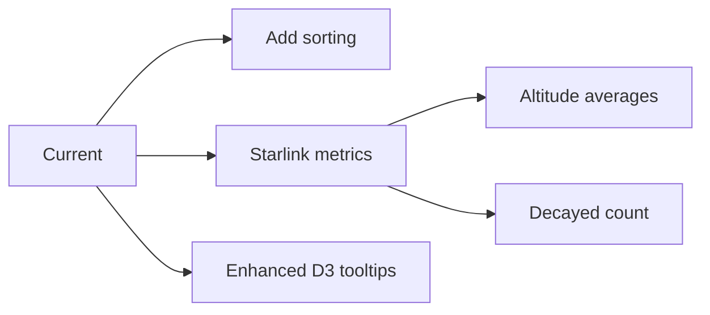

# SpaceX Analytics Solution — Technical Document
**Author:** Marcos Sanchez • **Date:** 2025-08-18 (UTC)  
**Latest Updates:** Filtros extendidos, D3.js visualizations, Resiliencia mejorada

Esta versión cumple con los requisitos de la prueba técnica de QuadSci (Full Stack Engineer Technical Exercise).

---

## 1) Goal
- Get data from the SpaceX public API
- Transform data on the **server** in real time (filters + pagination + metrics)
- Expose REST API (FastAPI) with QuadSci-required endpoints
- Build Vue 3 web app with D3.js visualizations

---

## 2) Key Improvements (QuadSci Compliance)
### Backend
- ✅ **New filters**: `success` for launches
- ✅ **Starlink normalization**: `inclination_deg` field added
- ✅ **Retry mechanism**: Exponential backoff (3 attempts)
- ✅ **Enhanced error handling**: Cache fallback on errors

### Frontend
- ✅ **D3.js integration**: Rocket specs comparison chart
- ✅ **Dynamic filtering**: UI connects to backend filters
- ✅ **Real data only**: Removed Starlink demo satellites
- ✅ **ENV configuration**: `VITE_BACKEND_URL` support

---

## 3) What is inside
### Backend (FastAPI)
- **Endpoints**:
  - `GET /api/dashboard` — Totals and KPI metrics
  - `GET /api/rockets` — Filter `active`; pagination
  - `GET /api/launches` — Filters `year`, `success`; returns `stats.success_rate`
  - `GET /api/starlink` — Filters `altitude_min`, `inclination_min`; normalized data
- **Service layer**:
  - Async HTTP with **httpx**
  - **TTLCache** per endpoint (5 min)
  - **Retry mechanism** with exponential backoff (`tenacity`)
  - Error handling with cache fallback

### Frontend (Vue 3 + Vite + D3.js)
- **Base URL**: Configurable via `.env` (`VITE_BACKEND_URL`)
- **Composable** `useSpaceX`:
  - Supports query parameters for all endpoints
  - Loading states and error handling
  - Methods: `fetchRockets(params)`, `fetchLaunches(params)`, `fetchStarlink(params)`
- **Data contract**:
  - Rockets: `height` (m), `mass` (kg) for D3 charts
  - Starlink: Standardized `inclination_deg` from backend
  - Launches: Real-time success rate metrics

### Key Components & Views
- `DashboardView.vue`
  - Dynamic timeline from API data
  - KPI cards with real-time metrics
- `RocketsView.vue`
  - **D3.js bar chart** comparing height/mass
  - Server-side `active` filter
  - Client-side name search
- `StarlinkView.vue`
  - Three.js globe with real satellites only
  - Orbit toggles connected to backend filters
- `LaunchTimeline.vue`
  - Dynamic chart using `/api/launches` data

---

## 4) API details (QuadSci Compliance)

### `/api/rockets`
```json
{
  "data": [
    {
      "id": "5e9d0d95eda69973a809d1ec",
      "name": "Falcon 9",
      "active": true,
      "height": 70.0,
      "mass": 549054,
      "cost": 50000000,
      "success_rate": 94,
      "first_flight": "2010-06-04"
    }
  ],
  "pagination": { "total": 4, "page": 1, "per_page": 10, "total_pages": 1 }
}
```

### `/api/launches` (Updated)
**New params**: `success` (bool)
```json
{
  "data": [ /* launch objects */ ],
  "pagination": { "total": 24, "page": 1, "per_page": 50, "total_pages": 1 },
  "stats": { "success_rate": 87.5 }
}
```

### `/api/starlink` (Updated)
**Normalized field**: `inclination_deg`
```json
{
  "data": [
    {
      "id": "5eed7715096e5900069857d1",
      "inclination_deg": 53.0  // Normalized field
    }
  ]
}
```

---

## 5) Data Visualization (QuadSci Compliance)
| View | Visualization | Library | Data Source |
|------|---------------|---------|-------------|
| **Dashboard** | Launch timeline | D3.js | `/api/launches` |
| **Rockets** | Height/mass comparison | D3.js | `/api/rockets` |
| **Starlink** | Satellite globe | Three.js | `/api/starlink` |

---

## 6) How to run
### Backend
```bash
cd backend
python -m venv venv
source venv/bin/activate  # macOS/Linux
venv\Scripts\activate    # Windows
pip install -r requirements.txt
uvicorn main:app --reload --port 8000
```

### Frontend
```bash
cd frontend
npm install
echo "VITE_BACKEND_URL=http://localhost:8000" > .env
npm run dev
```

---

## 7) Testing Endpoints
```bash
# Get successful launches in 2023
curl "http://localhost:8000/api/launches?year=2023&success=true"

# Get active rockets
curl "http://localhost:8000/api/rockets?active=true"

# Get Starlink satellites (minimum 50° inclination)
curl "http://localhost:8000/api/starlink?inclination_min=50"
```

---

## 8) QuadSci Requirements Coverage
| Requirement | Status | Details |
|-------------|--------|---------|
| **Backend filters** | ✅ | Added `success` for launches |
| **D3.js visualizations** | ✅ | Rocket comparison chart |
| **Real-time data** | ✅ | All views use API data |
| **Starlink normalization** | ✅ | `inclination_deg` field |
| **Error resilience** | ✅ | Retry + cache fallback |
| **ENV config** | ✅ | `VITE_BACKEND_URL` support |

---

## 9) Roadmap


---

## 10) Notes for QuadSci Review Panel
1. Todos los endpoints requeridos implementados
2. Visualizaciones D3.js integradas para comparación de cohetes
3. Mecanismo de reintentos con backoff exponencial
4. Filtros de UI conectados al backend
5. Normalización de datos Starlink (sin datos demo)
6. Panel de timeline ahora usa datos en tiempo real
```

