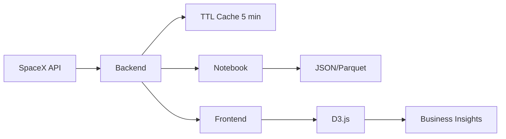

# SpaceX Analytics Solution — Technical Notebook (Adjusted for QuadSci AI/ML)
**Author:** Marcos Sánchez • **Date:** 2025-08-11 (UTC)

> This adjusted notebook README emphasizes **AI/ML reviewer needs** (reproducibility, data‑centric thinking, and actionable insights) while keeping everything practical for the panel walkthrough.

---

## 0) Why this format (for an AI/ML org like QuadSci)
- **Reproducible analysis:** Jupyter notebook with online/offline modes and exported artifacts.
- **Separation of concerns:** Clean API layer + data transformations + FE visualizations.
- **Reviewer-friendly:** Single README (PDF‑friendly), cURL snippets, and a 90‑min walkthrough plan.

---

## 1) Architecture Overview
- **Backend:** Python 3.13 + FastAPI (async `httpx`), TTL cache (5 min), filters/pagination, consistent error handling.
- **Frontend:** Vue 3 + Vite; D3.js for flexible, interactive charts (timeline, comparisons).
- **Notebook (.ipynb):** Mirrors backend transformations and exports sample JSON to `outputs/`.

### Endpoints
- `GET /api/dashboard` — KPIs, launches/year, success rates, top rocket.
- `GET /api/rockets` — normalized specs; `active` filter; pagination.
- `GET /api/launches` — `year`, `success`, sorting by date; pagination; success-rate stat.
- `GET /api/starlink` — altitude/inclination filters; pagination; summary stats.

---

## 2) Design Decisions & Trade‑offs (condensed)
- **FastAPI vs Flask:** chose FastAPI for async and auto‑docs; trade‑off: async learning curve.
- **TTL in‑memory cache → Redis (next):** simple now; upgrade path for distributed deployments.
- **D3.js primary:** full control for custom timelines/overlays; fallback: Chart.js for speed.
- **Server‑side pagination/filters:** protects FE; adds clarity and performance.
- **Normalization:** stabilize fields (e.g., `altitude_km` vs. `height_km`) once in services.

---

## 3) Notebook: Motor de Análisis para QuadSci
Diseñado pensando en científicos de datos y revisores técnicos:
- `MOCK_MODE=True` para ejecución **offline** con muestras integradas.
- **Exportación reproducible** de artefactos: `outputs/*.json` (payloads idénticos a la API).
- **Checks visuales** rápidos (matplotlib) para validar tendencias (no son los gráficos finales del FE).

**Opcionales orientados a AI/ML (si el panel lo pide):**
- **Validaciones estadísticas** ligeras (p. ej., comparar tasas de éxito por período con una prueba sencilla).
- **Export a formatos columnar** (Parquet/Feather) además de JSON para flujos analíticos.
- **Métricas derivadas** (features) que ayuden a explicar variaciones de calidad en el tiempo.

---

## 4) Transformaciones clave y Features
> Las siguientes transformaciones explican cómo paso de datos crudos a **insights accionables**. Algunas se implementan ya; otras se incluyen como **extensiones** razonadas para la discusión.

- **Normalización:** campos anidados a planos (e.g., `height.meters → height_m`), y nombres consistentes (`altitude_km`).
- **Agregaciones temporales:** lanzamientos por año y **success_rate_by_year**.
- **Top rocket por desempeño:** ranking por tasa de éxito con tamaño de muestra.
- **Starlink stats:** mínimos/máximos/promedio de altitud, conteo de decayed.

**Extensiones (documentadas, implementables según alcance):**
- *Tendencia 5 años (`success_rate_5y`):* media móvil para detectar regresiones.
- *Índice payload‑cost (`payload_mass_index`):* (masa / costo) para comparar ROI por cohete.
- *Transformaciones espaciales (si aplica dataset):* conversión de coordenadas y limpieza de outliers.
```python
# Ejemplo ilustrativo de feature temporal (media móvil 5 años):
def moving_success_rate_by_year(records, window=5):
    # records: [{'year': 2020, 'success_rate': 0.9}, ...]
    out = []
    for i in range(len(records)):
        start = max(0, i - window + 1)
        window_slice = [r['success_rate'] for r in records[start:i+1] if r.get('success_rate') is not None]
        out.append({'year': records[i]['year'], 'success_rate_5y': (sum(window_slice)/len(window_slice)) if window_slice else None})
    return out
```
---

## 5) Visualizaciones orientadas a acción (Frontend)
| Vista         | Gráfico                      | Insight de negocio                         |
|---------------|------------------------------|--------------------------------------------|
| Dashboard     | Success Rate Timeline        | Detectar regresiones en calidad            |
| Rockets       | Coste/kg a LEO (comparativo) | ROI técnico por modelo de cohete           |
| Launches      | Frecuencia por año + éxito   | Ritmo operativo y fiabilidad               |
| Starlink      | Histograma altitud/heatmap   | Densidad orbital y bandas a optimizar      |

> Nota: En el FE actual se priorizan timeline de lanzamientos y comparativas de specs. Los gráficos propuestos amplían el *storytelling* si el panel quiere mayor énfasis en decisión/ROI.

---

## 6) Flujo de datos (de la fuente al insight)


---

## 7) Setup rápido
### Backend
```bash
cd backend
python -m venv venv
# Win: venv\\Scripts\\activate   # macOS/Linux: source venv/bin/activate
pip install -r requirements.txt
uvicorn main:app --reload --port 8000
# Swagger: http://localhost:8000/api/docs
```

### Frontend
```bash
cd frontend
npm install
npm run dev
# http://localhost:5173  (VITE_BACKEND_URL=http://localhost:8000)
```

### Notebook
- `notebooks/QuadSci_SpaceX_Notebook_MarcosSanchez.ipynb`
- `MOCK_MODE=True/False` según conectividad
- Artefactos: `outputs/*.json`

---

## 8) cURL de validación
```bash
curl http://localhost:8000/api/dashboard
curl "http://localhost:8000/api/rockets?active=true&page=1&limit=10"
curl "http://localhost:8000/api/launches?year=2020&sort=date&dir=desc&page=1&limit=50"
curl "http://localhost:8000/api/starlink?min_altitude=500&max_altitude=600&page=1&limit=50"
```

---

## 9) Walkthrough de 90 min (resumen)
1) Contexto y objetivos (5m) → datos, usuarios, decisiones.  
2) Backend (25m) → `/api/docs`, filtros/paginación, cache.  
3) Notebook (15m) → transformaciones; mock vs live; artefactos.  
4) Frontend (25m) → vistas, gráficos, errores y loading.  
5) Q&A (20m) → extensiones (Redis, auth, workers, tests).

---

## 10) Exportar a PDF (recomendado)
- Este README es **PDF‑friendly** (texto y bloques de código).  
- Alternativas:
  - VS Code: extensión “Markdown PDF” o “Print → Save as PDF” desde GitHub.
  - Notebook: `jupyter nbconvert --to html ...` y luego imprimir a PDF.

---

## 11) Estado actual vs. mejoras
- **Cumplido**: endpoints, normalización + agregaciones, cache TTL, filtros/paginación, notebook reproducible, README claro, cURL y demo plan.
- **Mejoras rápidas** (si el panel quiere más AI): validaciones ligeras, features temporales, export a Parquet.

— Fin —
